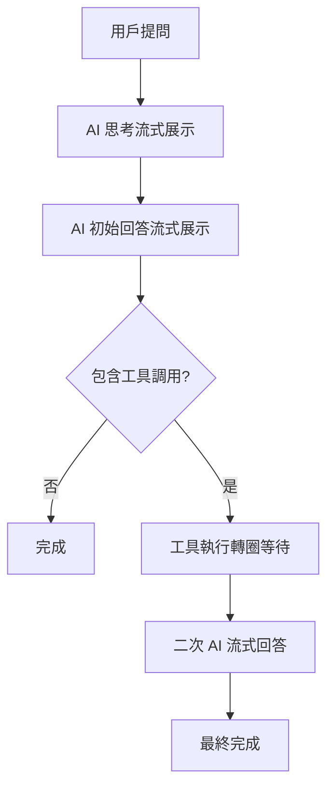

# AI 回答流式展示系統使用指南

## 概述

SFDA Nexus 現在支持完整的 AI 回答流式展示，包括：

1. **第一階段**：AI 思考過程（流式）
2. **第二階段**：AI 初始回答（流式）
3. **第三階段**：工具調用執行（轉圈等待）
4. **第四階段**：二次 AI 回答優化（流式）✨ **新功能**

## 系統架構

### 流式處理流程



### 核心組件

#### 後端組件

1. **AIService.callModel()**
   - 支持 `stream: true` 參數
   - 返回 AsyncGenerator 進行流式輸出

2. **ChatService.processChatMessage()**
   - 檢測工具調用
   - 執行工具
   - 支持流式二次 AI 調用

3. **Chat Controller (Stream)**
   - 處理 SSE 事件流
   - 管理二次 AI 流式調用

#### 前端組件

1. **ChatStore**
   - 處理 SSE 事件
   - 管理打字機動畫
   - 支持二次流式事件

2. **MessageBubble**
   - 顯示思考內容動畫
   - 處理流式內容展示

## 新增功能：二次 AI 流式調用

### 觸發條件

當滿足以下條件時，會啟用二次 AI 流式調用：

1. 工具調用執行成功
2. 上下文包含 `stream: true` 或 `enableSecondaryStream: true`
3. 需要生成用戶友好的回答

### SSE 事件類型

#### 新增事件

- `secondary_ai_stream_start`: 二次 AI 流式調用開始
- `secondary_ai_stream_done`: 二次 AI 流式調用完成  
- `secondary_ai_stream_error`: 二次 AI 流式調用錯誤

#### 事件數據格式

```javascript
// secondary_ai_stream_start
{
  "event": "secondary_ai_stream_start",
  "data": {
    "assistant_message_id": 12345,
    "message": "開始流式生成回應...",
    "conversation_id": 367
  }
}

// stream_content (二次調用期間)
{
  "event": "stream_content", 
  "data": {
    "content": "根據查詢結果，目前系統中...", // 累積內容
    "full_content": "根據查詢結果，目前系統中共有 5 個部門...",
    "thinking_content": "合併的思考內容",
    "tokens_used": 150,
    "assistant_message_id": 12345
  }
}

// secondary_ai_stream_done
{
  "event": "secondary_ai_stream_done",
  "data": {
    "assistant_message_id": 12345,
    "full_content": "完整的最終回答",
    "tokens_used": 200,
    "conversation_id": 367
  }
}
```

## 使用方式

### 後端配置

在 `chatService.processChatMessage()` 調用時傳入流式參數：

```javascript
const chatResult = await chatService.processChatMessage(
  aiResponse,
  {
    user_id: user.id,
    conversation_id: conversationId,
    model_id: model.id,
    model_config: model,
    stream: true, // 🔧 啟用流式二次 AI 調用
    enableSecondaryStream: true, // 🔧 明確啟用二次流式調用
    onSecondaryAIStart: () => {
      // 二次調用開始的回調
    },
  }
);
```

### 前端處理

前端會自動處理新的 SSE 事件：

```javascript
// 在 ChatStore 中自動處理
case "secondary_ai_stream_start":
  // 設置流式狀態
  message.isStreamingSecondary = true;
  break;

case "stream_content":
  // 如果是二次流式調用期間，使用打字機動畫
  if (message.isStreamingSecondary) {
    animateTyping(messageIndex, currentContent, newContent);
  }
  break;

case "secondary_ai_stream_done":
  // 清除流式狀態
  message.isStreamingSecondary = false;
  break;
```

## 用戶體驗流程

### 完整對話流程

1. **用戶提問**：「請查詢部門列表，並告訴我有多少個部門」

2. **AI 思考（流式）**：
   ```
   🧠 思考中...
   用戶想要查詢部門列表，我需要調用 get_department_list 工具...
   ```

3. **AI 初始回答（流式）**：
   ```
   💭 我來幫您查詢部門列表...
   <tool_call>
   get_department_list
   {"sortBy": "code"}
   </tool_call>
   ```

4. **工具執行**：
   ```
   🔧 正在查詢部門數據...
   ⏳ 工具處理中，請稍候...
   ```

5. **二次 AI 回答（流式）**：
   ```
   🌊 開始流式生成回應...
   📝 根據查詢結果，目前系統中共有 5 個部門：
   
   1. **研發部** (RD) - 負責產品研發
   2. **生產部** (PROD) - 負責生產製造  
   3. **品保部** (QA) - 負責品質保證
   4. **業務部** (SALES) - 負責銷售業務
   5. **管理部** (ADMIN) - 負責行政管理
   
   這些部門涵蓋了公司的主要業務功能。
   ```

### 視覺效果

- **思考階段**：淡藍色背景，逐字動畫
- **工具執行**：轉圈加載，心跳提示
- **二次回答**：正常背景，打字機效果
- **完成狀態**：移除所有動畫標記

## 性能優化

### 流式調用優化

1. **溫度設置**：二次調用使用 `temperature: 0.3`，減少隨機性
2. **Token 限制**：`max_tokens: 800`，確保回應完整但不冗長
3. **實時更新**：流式過程中實時更新資料庫

### 錯誤處理

1. **網絡中斷**：自動檢測客戶端斷開
2. **AI 調用失敗**：回退到非流式結果
3. **超時處理**：5分鐘超時保護

## 配置選項

### 環境變數

```bash
# 在 .env 中配置
ENABLE_SECONDARY_STREAMING=true  # 啟用二次流式調用
SECONDARY_AI_TIMEOUT=300000      # 二次調用超時時間（毫秒）
SECONDARY_AI_TEMPERATURE=0.3     # 二次調用溫度
SECONDARY_AI_MAX_TOKENS=800      # 二次調用最大 tokens
```

### 模型支持

目前支持的模型：
- ✅ Ollama (qwen3:32b, llama3, etc.)
- ✅ Gemini (gemini-pro, gemini-1.5-pro)
- 🔄 OpenAI (計劃支持)
- 🔄 Claude (計劃支持)

## 故障排除

### 常見問題

1. **二次調用不是流式的**
   - 檢查 `enableSecondaryStream: true` 是否設置
   - 確認模型支持流式調用

2. **前端沒有打字機效果**
   - 檢查 SSE 事件是否正確接收
   - 確認 `isStreamingSecondary` 狀態

3. **工具調用後沒有二次調用**
   - 檢查工具執行是否成功
   - 確認 `hasSuccessfulTools` 為 true

### 調試方法

1. **後端調試**：
   ```bash
   # 查看詳細日誌
   NODE_ENV=development npm start
   ```

2. **前端調試**：
   ```javascript
   // 在瀏覽器控制台查看 SSE 事件
   console.log("SSE Event:", eventType, data);
   ```

3. **測試腳本**：
   ```bash
   # 運行測試腳本
   node test_streaming_secondary_ai.js
   ```

## 未來擴展

### 計劃功能

1. **多輪工具調用**：支持工具調用鏈式執行
2. **並行工具調用**：同時執行多個工具
3. **智能回退**：根據網絡狀況自動選擇流式/非流式
4. **用戶偏好**：允許用戶選擇是否啟用流式展示

### API 擴展

計劃添加的 API 端點：
- `/api/chat/stream-config` - 流式配置管理
- `/api/chat/stream-stats` - 流式性能統計
- `/api/chat/stream-health` - 流式健康檢查

---

**注意**：此功能需要後端服務器重啟才能生效。建議在低峰時段部署更新。 

## 🔧 問題修復記錄

### 修復：重複思考內容問題

**問題描述**：
- 在二次 AI 流式調用期間，思考內容會重複顯示
- 用戶看到第一次思考 → 工具調用 → 最終回答 → 又一遍思考內容

**根本原因**：
1. 二次 AI 調用的系統提示詞沒有明確禁止思考過程
2. 控制器在處理二次流式調用時仍然處理思考內容

**修復方案**：
1. **控制器修復**：在二次 AI 流式調用期間完全跳過思考內容處理
2. **提示詞修復**：明確禁止二次調用使用 `<think>...</think>` 標籤
3. **邏輯優化**：確保思考內容只在第一次 AI 調用時顯示

**修復後行為**：
1. ✅ **第一階段**：AI 思考過程（流式）
2. ✅ **第二階段**：AI 初始回答（流式）  
3. ✅ **第三階段**：工具調用執行（轉圈等待）
4. ✅ **第四階段**：二次 AI 回答（流式，無重複思考）

**測試驗證**：
```bash
# 運行測試腳本驗證修復效果
node test_no_duplicate_thinking.js
```

--- 