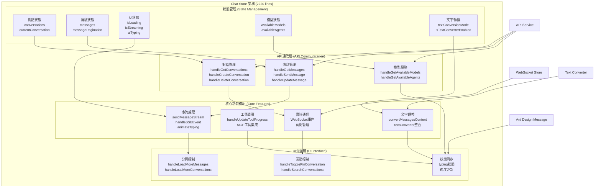

# Chat Store 架構與重構指南

## 📊 系統架構分析

### 現狀分析

- **檔案**：`frontend/src/stores/chat.js`
- **規模**：2220 行代碼
- **功能**：聊天系統的完整狀態管理
- **問題**：檔案過大，職責混雜，維護困難

### 核心功能模組

1. **對話管理**：CRUD、分頁、搜尋、釘選
2. **消息處理**：發送、接收、分頁載入
3. **串流處理**：SSE 事件、打字機動畫
4. **工具調用**：傳統工具 + MCP 工具支援
5. **文字轉換**：繁簡轉換即時應用
6. **WebSocket**：房間管理、實時同步

## 🏗️ 系統架構圖



## 🔄 重構方案

### 重構目標

🎯 **將 2220 行的單一檔案拆分成多個職責單一的小檔案**

### 新架構設計

```
frontend/src/stores/
├── chat.js                     (主Store, <200行)
└── composables/
    ├── useConversation.js       (對話管理, <400行)
    ├── useMessage.js            (消息管理, <400行)
    ├── useStreaming.js          (串流處理, <400行)
    ├── useToolCall.js           (工具調用, <300行)
    └── useTextConversion.js     (文字轉換, <200行)
```

### 重構階段

#### 第一階段 (週 1)：基礎拆分

- [ ] 創建 useConversation.js（對話 CRUD、分頁、搜尋）
- [ ] 創建 useMessage.js（消息 CRUD、分頁載入）

#### 第二階段 (週 2-3)：進階功能

- [ ] 創建 useStreaming.js（SSE 事件、打字機動畫）
- [ ] 創建 useToolCall.js（工具調用生命週期）
- [ ] 創建 useTextConversion.js（文字轉換）

#### 第三階段 (週 4)：整合優化

- [ ] 重構主 chat.js 整合所有 composables
- [ ] 測試並確保功能完整性

### 重構原則

- ✅ **零破壞性變更**：所有現有功能保持不變
- ✅ **保持介面一致**：對外 API 完全不變
- ✅ **漸進式重構**：一次重構一個模組
- ✅ **單一職責**：每個檔案功能專一

## 📋 核心任務清單

### 高優先級任務

1. **useConversation.js** - 對話管理模組
2. **useMessage.js** - 消息管理模組
3. **useStreaming.js** - 串流處理模組

### 中優先級任務

4. **useToolCall.js** - 工具調用模組
5. **useTextConversion.js** - 文字轉換模組

### 最終整合

6. **chat.js 重構** - 整合所有 composables

## 🎯 成功指標

- **檔案大小**：主檔案從 2220 行減少到 < 200 行
- **模組大小**：每個模組 < 500 行
- **功能完整**：所有現有功能正常運作
- **性能無退化**：重構後性能保持或提升

---

**下一步**：開始第一階段的基礎拆分工作
