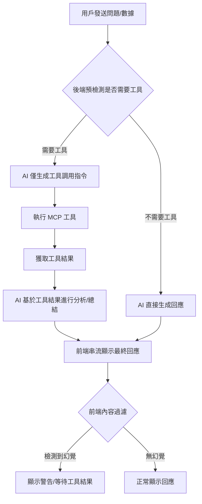

# SFDA Nexus AI + MCP 工具調用防幻覺流程圖

2025-07-02

本流程圖說明：

- 用戶發送問題或數據後，後端會先預檢測是否需要調用 MCP 工具。
- 若需要，AI 僅生成工具調用指令，執行工具並獲取結果後再進行分析。
- 前端會對回應內容進行過濾，若發現幻覺則顯示警告。

```mermaid
flowchart TD
    A[用戶發送問題/數據] --> B{後端預檢測是否需要工具}
    B -- 需要工具 --> C[AI 僅生成工具調用指令]
    C --> D[執行 MCP 工具]
    D --> E[獲取工具結果]
    E --> F[AI 基於工具結果進行分析/總結]
    F --> G[前端串流顯示最終回應]
    B -- 不需要工具 --> H[AI 直接生成回應]
    H --> G
    G --> I{前端內容過濾}
    I -- 檢測到幻覺 --> J[顯示警告/等待工具結果]
    I -- 無幻覺 --> K[正常顯示回應]
```
