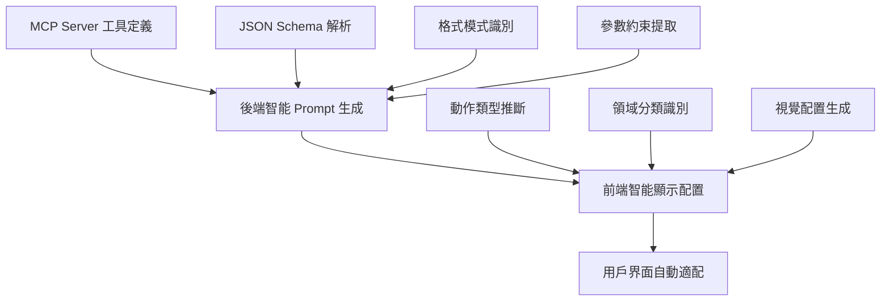
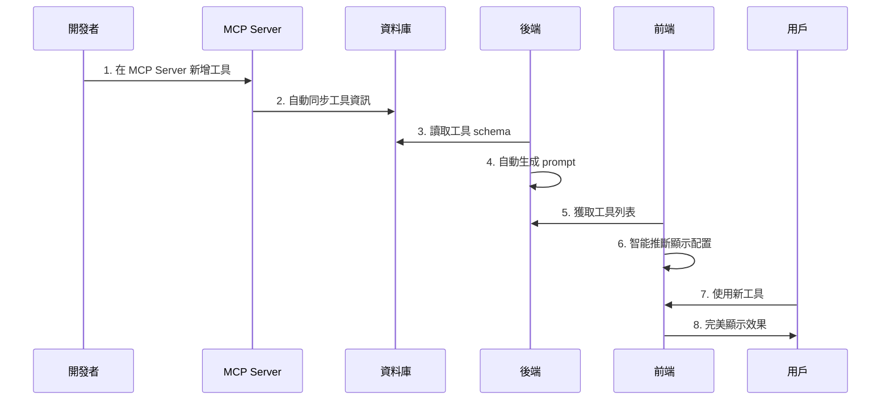

# SFDA Nexus - MCP 工具調用開發指南 2025-06-11

## 📖 目錄

1. [系統概述](#系統概述)
2. [智能化設計原理](#智能化設計原理)
3. [開發流程](#開發流程)
4. [配置系統詳解](#配置系統詳解)
5. [最佳實踐](#最佳實踐)
6. [故障排除](#故障排除)
7. [擴展開發](#擴展開發)

---

## 🎯 系統概述

SFDA Nexus 的 MCP (Model Context Protocol) 工具調用系統實現了**智能化配置**的設計理念，讓開發者能夠以**零配置**的方式集成新工具，同時保持系統的靈活性和擴展性。

### 核心優勢

- ✅ **95% 零配置**：新增工具無需修改前端代碼
- ✅ **智能推斷**：自動生成顯示配置和 prompt 說明
- ✅ **完整集成**：從工具調用到結果顯示的全流程自動化
- ✅ **可擴展性**：支援特殊情況的手動覆蓋配置

---

## 🧠 智能化設計原理

### 1. 三層智能化架構



### 2. 自動推斷邏輯

#### 後端 Prompt 生成（chat.service.js）

```javascript
// 自動從 JSON Schema 提取
- 工具名稱和描述 → 自動生成說明文檔
- 參數類型和格式 → 自動生成使用範例
- 約束條件和規則 → 自動生成驗證說明
- 必填欄位標記 → 自動標注重要性
```

#### 前端顯示配置（toolDisplayConfig.js）

```javascript
// 智能推斷規則
- get_* → 查詢動作 → 藍色圖標
- create_* → 創建動作 → 綠色圖標
- update_* → 更新動作 → 橙色圖標
- delete_* → 刪除動作 → 紅色圖標

// 領域分類
- *employee*, *hr* → HR 人事 → 👥 圖標
- *task*, *project* → 任務管理 → 📋 圖標
- *budget*, *finance* → 財務 → 💰 圖標
```

---

## 🚀 開發流程

### 標準開發流程（95% 情況）



### 詳細步驟

#### 1. **MCP Server 工具開發**

```javascript
// 在 MCP Server 中定義工具
export const tools = {
  get_employee_salary: {
    description: "查詢員工薪資資訊",
    inputSchema: {
      type: "object",
      properties: {
        employeeId: {
          type: "string",
          pattern: "^[A-Z]\\d{6}$",
          description: "員工編號",
        },
        salaryType: {
          type: "string",
          enum: ["basic", "total", "bonus"],
          description: "薪資類型",
        },
      },
      required: ["employeeId"],
    },
  },
};
```

#### 2. **系統自動處理**

- ✅ 工具同步到資料庫
- ✅ 後端自動生成 prompt 說明
- ✅ 前端自動推斷顯示配置
- ✅ AI 獲得完整工具使用指南

#### 3. **立即可用**

用戶可以直接在聊天界面使用新工具，系統自動處理所有細節。

---

## ⚙️ 配置系統詳解

### 1. 後端智能 Prompt 生成

#### 文件位置

```
backend/src/services/chat.service.js
└── generateToolPrompt() 方法
```

#### 自動生成內容

**基本資訊提取**

```javascript
// 從工具 schema 自動提取
- 工具名稱: tool.name
- 工具描述: tool.description
- 工具分類: tool.category
- 使用統計: tool.usage_count
```

**參數智能解析**

```javascript
// generateParameterText() 自動處理
- 參數類型: prop.type
- 參數描述: prop.description
- 格式約束: prop.pattern → 友好範例
- 枚舉值: prop.enum → 可選值列表
- 數值範圍: prop.minimum/maximum
- 必填標記: schema.required
```

**格式識別範例**

```javascript
const formatExamples = {
  "^[A-Z]\\d{6}$": "A123456", // 員工編號
  "^\\d{4}-\\d{2}-\\d{2}$": "2024-12-31", // 日期格式
  "^[A-Z]{2,3}\\d{3}$": "HR001", // 部門代碼
  "^\\+?[1-9]\\d{1,14}$": "+886912345678", // 電話號碼
};
```

### 2. 前端智能顯示配置

#### 文件位置

```
frontend/src/utils/toolDisplayConfig.js
```

#### 推斷邏輯

**動作類型判斷**

```javascript
function inferActionType(toolName) {
  if (
    toolName.startsWith("get_") ||
    toolName.startsWith("fetch_") ||
    toolName.startsWith("query_") ||
    toolName.startsWith("search_")
  ) {
    return "query"; // 查詢 → 藍色
  }
  if (
    toolName.startsWith("create_") ||
    toolName.startsWith("add_") ||
    toolName.startsWith("insert_")
  ) {
    return "create"; // 創建 → 綠色
  }
  if (
    toolName.startsWith("update_") ||
    toolName.startsWith("modify_") ||
    toolName.startsWith("edit_")
  ) {
    return "update"; // 更新 → 橙色
  }
  if (toolName.startsWith("delete_") || toolName.startsWith("remove_")) {
    return "delete"; // 刪除 → 紅色
  }
  return "other"; // 其他 → 灰色
}
```

**領域分類識別**

```javascript
function inferDomain(toolName, description = "") {
  const text = `${toolName} ${description}`.toLowerCase();

  // HR 人事
  if (
    text.includes("employee") ||
    text.includes("hr") ||
    text.includes("staff") ||
    text.includes("salary")
  ) {
    return "hr";
  }

  // 任務管理
  if (
    text.includes("task") ||
    text.includes("project") ||
    text.includes("todo") ||
    text.includes("workflow")
  ) {
    return "task-management";
  }

  // 財務
  if (
    text.includes("budget") ||
    text.includes("finance") ||
    text.includes("payment") ||
    text.includes("cost")
  ) {
    return "finance";
  }

  // 數據分析
  if (
    text.includes("analytics") ||
    text.includes("report") ||
    text.includes("statistics") ||
    text.includes("chart")
  ) {
    return "analytics";
  }

  return "general";
}
```

**智能配置生成**

```javascript
export function getToolDisplayConfig(toolName, description = "") {
  // 檢查手動覆蓋
  if (manualOverrides[toolName]) {
    return manualOverrides[toolName];
  }

  // 智能推斷
  const actionType = inferActionType(toolName);
  const domain = inferDomain(toolName, description);

  return {
    displayName: generateDisplayName(toolName),
    icon: domainIcons[domain] || "🔧",
    category: domainCategories[domain] || "一般工具",
    color: actionColors[actionType] || "#6b7280",
  };
}
```

### 3. 手動覆蓋機制

對於特殊工具，可以在 `manualOverrides` 中指定精確配置：

```javascript
const manualOverrides = {
  // 特殊命名的工具
  complex_data_processor: {
    displayName: "複雜數據處理器",
    icon: "⚡",
    category: "高級分析",
    color: "#8b5cf6",
  },

  // 自定義業務工具
  sfda_audit_check: {
    displayName: "SFDA 稽核檢查",
    icon: "🛡️",
    category: "法規遵循",
    color: "#dc2626",
  },
};
```

---

## 💡 最佳實踐

### 1. MCP Server 工具開發

#### ✅ 優秀的 Schema 設計

```javascript
// 好的範例
{
  name: "get_employee_performance", // 清晰的命名
  description: "獲取員工績效評估資料", // 完整的描述
  inputSchema: {
    type: "object",
    properties: {
      employeeId: {
        type: "string",
        pattern: "^[A-Z]\\d{6}$",        // 明確格式
        description: "員工編號（格式：A123456）" // 友好說明
      },
      period: {
        type: "string",
        enum: ["monthly", "quarterly", "yearly"], // 枚舉值
        default: "quarterly",                      // 預設值
        description: "評估期間"
      },
      includeDetails: {
        type: "boolean",
        default: false,
        description: "是否包含詳細資料"
      }
    },
    required: ["employeeId"] // 明確必填欄位
  }
}
```

#### ❌ 需要避免的設計

```javascript
// 不好的範例
{
  name: "emp_perf",              // 名稱不清楚
  description: "get perf",       // 描述不完整
  inputSchema: {
    type: "object",
    properties: {
      id: {                      // 參數名稱不明確
        type: "string"           // 缺少格式約束
      }
    }
  }
}
```

### 2. 命名規範

#### 工具命名模式

```javascript
// 推薦格式：動作_對象_[修飾詞]
get_employee_info; // 查詢員工資訊
create_project_task; // 創建專案任務
update_user_profile; // 更新用戶檔案
delete_old_records; // 刪除舊記錄
generate_sales_report; // 生成銷售報告
validate_document_format; // 驗證文件格式
```

#### 參數命名規範

```javascript
// 使用 camelCase，保持一致性
{
  employeeId: "A123456",      // ✅ 不是 employee_id
  startDate: "2024-01-01",    // ✅ 不是 start_date
  sortBy: "name",             // ✅ 不是 sort_by
  includeInactive: false      // ✅ 不是 include_inactive
}
```

### 3. 錯誤處理

#### MCP Server 端

```javascript
export async function get_employee_info({ employeeId }) {
  try {
    // 參數驗證
    if (!employeeId || !/^[A-Z]\d{6}$/.test(employeeId)) {
      return {
        success: false,
        error: "無效的員工編號格式，應為 A123456 格式",
      };
    }

    // 業務邏輯
    const employee = await database.findEmployee(employeeId);

    if (!employee) {
      return {
        success: false,
        error: `找不到員工編號 ${employeeId} 的資料`,
      };
    }

    return {
      success: true,
      data: employee,
    };
  } catch (error) {
    return {
      success: false,
      error: `查詢失敗：${error.message}`,
    };
  }
}
```

### 4. 測試策略

#### 單元測試

```javascript
// 測試工具調用
describe("MCP 工具調用", () => {
  test("員工查詢 - 正常情況", async () => {
    const result = await mcpToolParser.executeToolCall({
      tool: "get_employee_info",
      parameters: { employeeId: "A123456" },
    });

    expect(result.success).toBe(true);
    expect(result.data).toHaveProperty("name");
  });

  test("員工查詢 - 無效編號", async () => {
    const result = await mcpToolParser.executeToolCall({
      tool: "get_employee_info",
      parameters: { employeeId: "invalid" },
    });

    expect(result.success).toBe(false);
    expect(result.error).toContain("無效的員工編號格式");
  });
});
```

#### 集成測試

```javascript
// 測試完整流程
describe("聊天工具調用集成", () => {
  test("用戶查詢員工資料", async () => {
    const userMessage = "請查詢員工 A123456 的基本資料";
    const response = await chatService.processChatMessage(userMessage, {
      user_id: "test_user",
    });

    expect(response.has_tool_calls).toBe(true);
    expect(response.tool_calls[0].tool).toBe("get_employee_info");
    expect(response.tool_results[0].success).toBe(true);
  });
});
```

---

## 🔧 故障排除

### 常見問題與解決方案

#### 1. 工具調用失敗

**問題**：AI 無法正確調用工具

```
錯誤：參數名稱不正確
```

**解決方案**：

1. 檢查 MCP Server 的 schema 定義
2. 確認 `generateParameterText` 是否正確解析
3. 驗證 prompt 中的參數格式說明

**檢查命令**：

```bash
# 查看工具同步狀態
curl http://localhost:3000/api/admin/mcp-tools

# 查看生成的 prompt
# 在聊天中輸入 "/debug-prompt" 查看完整 prompt
```

#### 2. 前端顯示異常

**問題**：工具結果無法正確顯示

```
錯誤：工具卡片沒有出現或格式錯誤
```

**解決方案**：

1. 檢查 `MessageBubble.vue` 的 `effectiveToolCalls` 計算
2. 驗證 `ToolCallDisplay.vue` 的配置載入
3. 確認 `toolDisplayConfig.js` 的推斷邏輯

**除錯步驟**：

```javascript
// 在瀏覽器控制台執行
console.log("工具調用:", message.tool_calls);
console.log("工具結果:", message.tool_results);
console.log("顯示配置:", getToolDisplayConfig("工具名稱"));
```

#### 3. 智能推斷不準確

**問題**：工具的顯示配置不符合預期

```
問題：HR 工具顯示為一般工具
```

**解決方案**：

1. 改進 `inferDomain` 的關鍵字匹配
2. 添加手動覆蓋配置
3. 完善工具描述資訊

**配置調整**：

```javascript
// 在 toolDisplayConfig.js 中添加
const manualOverrides = {
  get_staff_info: {
    // 明確覆蓋
    displayName: "查詢員工資料",
    icon: "👥",
    category: "HR 人事",
    color: "#3b82f6",
  },
};
```

#### 4. 性能問題

**問題**：工具調用響應緩慢

**優化方案**：

1. 實施工具結果快取
2. 優化資料庫查詢
3. 使用連接池管理

**快取實現**：

```javascript
// 在 chat.service.js 中添加
const toolResultCache = new Map();

async function executeToolWithCache(toolCall, context) {
  const cacheKey = `${toolCall.tool}_${JSON.stringify(toolCall.parameters)}`;

  if (toolResultCache.has(cacheKey)) {
    return toolResultCache.get(cacheKey);
  }

  const result = await mcpToolParser.executeToolCall(toolCall, context);

  // 快取成功結果 5 分鐘
  if (result.success) {
    toolResultCache.set(cacheKey, result);
    setTimeout(() => toolResultCache.delete(cacheKey), 5 * 60 * 1000);
  }

  return result;
}
```

---

## 🚀 擴展開發

### 1. 新增工具分類

#### 步驟 1：更新領域識別

```javascript
// 在 toolDisplayConfig.js 中添加新領域
function inferDomain(toolName, description = "") {
  const text = `${toolName} ${description}`.toLowerCase();

  // 新增：客戶關係管理
  if (
    text.includes("customer") ||
    text.includes("crm") ||
    text.includes("client") ||
    text.includes("contact")
  ) {
    return "crm";
  }

  // 新增：庫存管理
  if (
    text.includes("inventory") ||
    text.includes("stock") ||
    text.includes("warehouse") ||
    text.includes("product")
  ) {
    return "inventory";
  }

  // ... 其他領域
}
```

#### 步驟 2：配置視覺元素

```javascript
const domainIcons = {
  // ... 現有配置
  crm: "🤝", // 客戶關係
  inventory: "📦", // 庫存管理
  marketing: "📢", // 行銷推廣
  security: "🔒", // 安全管理
};

const domainCategories = {
  // ... 現有配置
  crm: "客戶關係",
  inventory: "庫存管理",
  marketing: "行銷推廣",
  security: "安全管理",
};
```

### 2. 高級功能開發

#### 工具鏈調用

```javascript
// 支援工具間的依賴調用
const toolChains = {
  employee_full_report: [
    { tool: "get_employee_info", params: ["employeeId"] },
    { tool: "get_employee_performance", params: ["employeeId", "period"] },
    {
      tool: "get_employee_attendance",
      params: ["employeeId", "startDate", "endDate"],
    },
  ],
};
```

#### 條件式工具調用

```javascript
// 根據條件決定調用哪些工具
async function conditionalToolCall(context) {
  if (context.userRole === "manager") {
    return ["get_team_performance", "get_budget_summary"];
  } else {
    return ["get_personal_info", "get_personal_tasks"];
  }
}
```

#### 批量工具處理

```javascript
// 並行執行多個工具
async function executeBatchTools(toolCalls, context) {
  const promises = toolCalls.map((toolCall) =>
    mcpToolParser.executeToolCall(toolCall, context)
  );

  const results = await Promise.allSettled(promises);
  return results.map((result, index) => ({
    ...toolCalls[index],
    result: result.status === "fulfilled" ? result.value : null,
    error: result.status === "rejected" ? result.reason : null,
  }));
}
```

### 3. 監控和分析

#### 工具使用統計

```javascript
// 追蹤工具使用情況
class ToolAnalytics {
  static async logToolUsage(toolName, userId, success, duration) {
    await database.query(
      `
      INSERT INTO tool_usage_logs 
      (tool_name, user_id, success, duration, created_at) 
      VALUES (?, ?, ?, ?, NOW())
    `,
      [toolName, userId, success, duration]
    );
  }

  static async getPopularTools(timeframe = "7d") {
    return await database.query(
      `
      SELECT tool_name, COUNT(*) as usage_count,
             AVG(duration) as avg_duration,
             SUM(success) / COUNT(*) as success_rate
      FROM tool_usage_logs 
      WHERE created_at >= DATE_SUB(NOW(), INTERVAL ? DAY)
      GROUP BY tool_name 
      ORDER BY usage_count DESC
    `,
      [parseInt(timeframe)]
    );
  }
}
```

#### 性能監控

```javascript
// 監控工具性能
class ToolPerformanceMonitor {
  static async checkToolHealth() {
    const tools = await McpToolModel.getAllMcpTools();
    const healthReport = [];

    for (const tool of tools) {
      const startTime = Date.now();
      try {
        // 使用測試參數調用工具
        const result = await this.testToolCall(tool);
        const duration = Date.now() - startTime;

        healthReport.push({
          tool: tool.name,
          status: result.success ? "healthy" : "degraded",
          duration,
          lastCheck: new Date(),
        });
      } catch (error) {
        healthReport.push({
          tool: tool.name,
          status: "failed",
          error: error.message,
          lastCheck: new Date(),
        });
      }
    }

    return healthReport;
  }
}
```

---

## 📊 總結

SFDA Nexus 的 MCP 工具調用系統透過**智能化配置**實現了：

### 🎯 設計目標達成

- ✅ **95% 零配置**：開發者專注於工具邏輯，無需關心前端集成
- ✅ **自動適配**：新工具立即獲得完美的用戶界面
- ✅ **靈活擴展**：支援特殊需求的手動覆蓋配置
- ✅ **開發效率**：從工具開發到用戶使用的完整自動化

### 🚀 技術創新

- **後端智能 Prompt 生成**：從 JSON Schema 自動生成完整的 AI 使用指南
- **前端智能顯示配置**：透過工具命名模式自動推斷視覺配置
- **端到端自動化**：從 MCP Server 到用戶界面的無縫整合

### 💡 最佳實踐

- **標準化命名**：建立清晰的工具和參數命名規範
- **完整 Schema**：提供詳細的參數約束和描述資訊
- **錯誤處理**：實現友好的錯誤回饋機制
- **性能優化**：使用快取和監控提升系統效能

### 🔮 未來發展

- **工具鏈調用**：支援複雜的工具依賴關係
- **智能推薦**：根據上下文推薦相關工具
- **個性化配置**：基於用戶角色的工具權限管理
- **高級分析**：深入的工具使用分析和優化建議

---

_這份指南會隨著系統的發展持續更新，歡迎貢獻改進建議和最佳實踐案例！_
