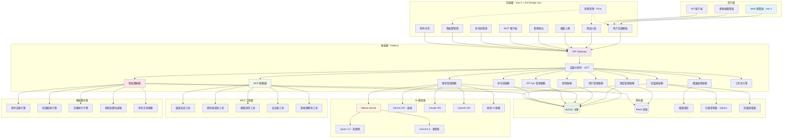

# sfda_nexus 企業 AI 聊天系統開發計劃

標語: "Connect. Create. Collaborate."
視覺: 多個節點連接的網絡圖案
色彩: 科技藍 + 智能綠
象徵: 企業 AI 生態的連接中心

## 📋 項目概述

**項目名稱**: sfda_nexus  
**項目類型**: 企業內部 AI 聊天系統  
**開發模式**: 統一管理，用戶使用  
**技術棧**: Vue 3 + Ant Design + Node.js + Express + MySQL

---

## 🎯 系統定位

- 🏢 **企業內部 AI 服務平台**
- 👥 **管理員統一配置，員工直接使用**
- 🤖 **預設智能體角色，標準化服務**
- 📋 **工作流程自動化**
- 🔒 **權限控制與審計**

---

## 🏗️ 技術架構

### **前端技術棧**

- **框架**: Vue 3 (Composition API)
- **UI 庫**: Ant Design Vue 4.x
- **狀態管理**: Pinia
- **路由**: Vue Router 4
- **HTTP 客戶端**: Axios
- **實時通信**: Socket.io / WebSocket
- **語言**: 純 JavaScript

### **後端技術棧**

- **框架**: Node.js + Express.js
- **資料庫**: MySQL 8.0
- **ORM**: 原生 SQL (mysql2)
- **認證**: JWT
- **檔案上傳**: Multer
- **API 文檔**: Swagger
- **實時通信**: Socket.io / WebSocket (ws)
- **語言**: 純 JavaScript

### **AI 整合**

- **本地模型**: Ollama (主要)
- **雲端服務**: Google Gemini (輔助)
- **向量資料庫**: Qdrant (知識庫)
- **工具協議**: MCP (Model Context Protocol)

### 目錄結構

```plaintext
sfda_nexus/
├── backend/
├── frontend/
├── docker-compose.yml
├── README.md
└── ...
```


